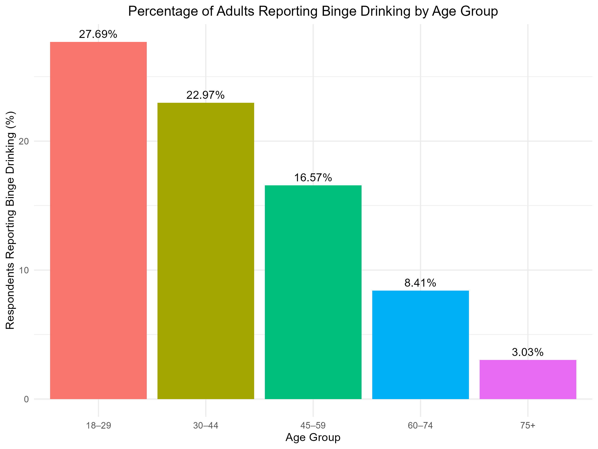
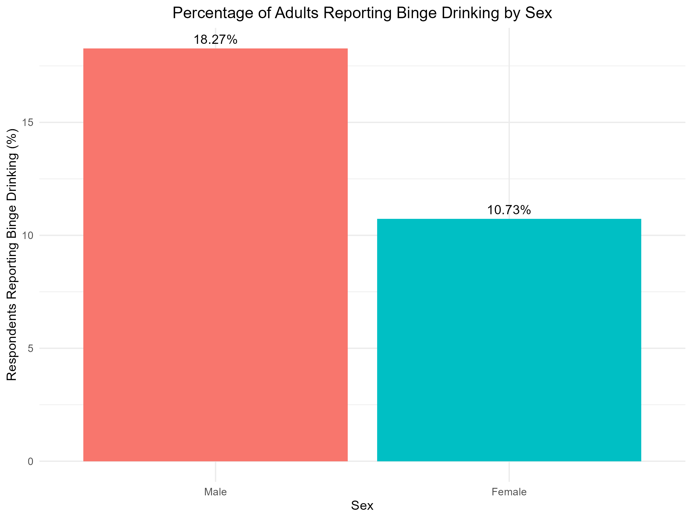
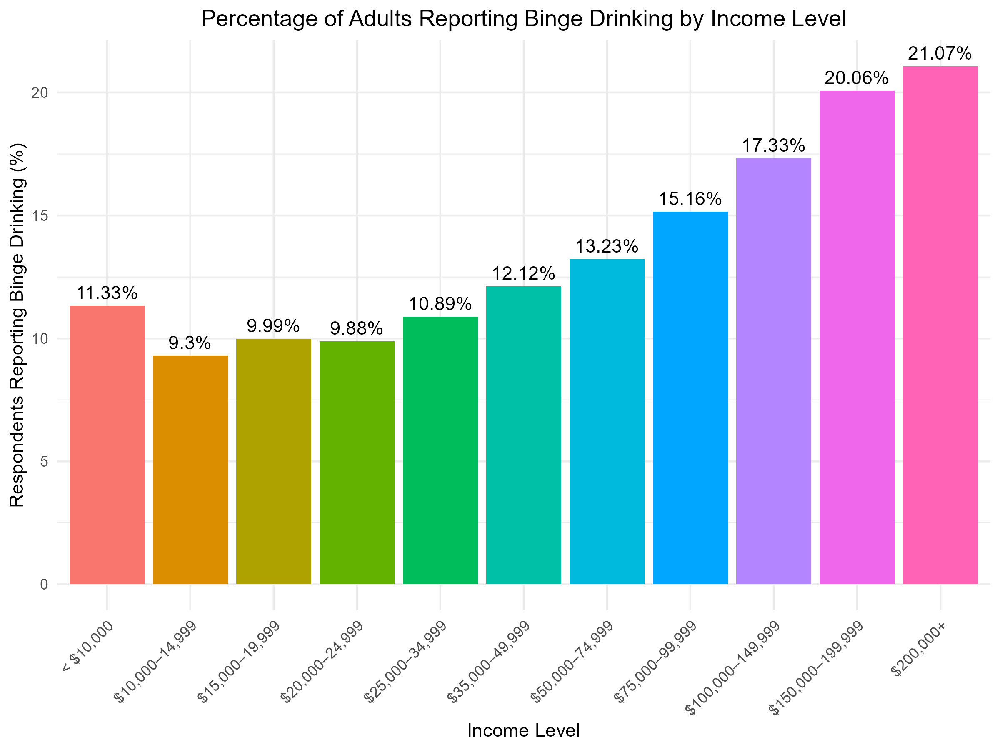

# BRFSS 2023 Binge Drinking Analysis

## Overview

This project explores demographic factors associated with binge drinking among U.S. adults using the 2023 Behavioral Risk Factor Surveillance System (BRFSS) dataset. The analysis was completed in R using data cleaning, descriptive statistics, data visualization, and chi-square tests.

## Research Question

Which demographic factors are most strongly associated with binge drinking among U.S. adults?

## Dataset

- Behavioral Risk Factor Surveillance System (BRFSS) 2023
- Source: Centers for Disease Control and Prevention (CDC)
- https://www.cdc.gov/brfss/annual_data/annual_2023.html

## Variables Included

- Age Group
- Sex
- Education
- Income
- Binge Drinking Status

## Methods

- Data cleaning and recoding
- Frequency tables
- Percentage calculations
- Bar charts using ggplot2
- Chi-square tests of independence

## Key Findings

- Younger adults reported the highest percentage of binge drinking.
- Males reported binge drinking more frequently than females.
- Higher income groups reported higher percentages of binge drinking.
- Education level showed relatively small differences in binge drinking prevalence.
- Chi-square tests indicated statistically significant associations between each demographic variable and binge drinking status.

## Repository Contents

- `BRFSS_binge_drinking_analysis.R` – Complete R analysis
- `Figures/` – Bar charts created during the analysis

## Packages Used

- haven
- dplyr
- ggplot2

## Author

Sebastian Radovic

## Visualizations

### Binge Drinking by Age Group

### Binge Drinking by Sex

### Binge Drinking by Education Level

### Binge Drinking by Income Level

